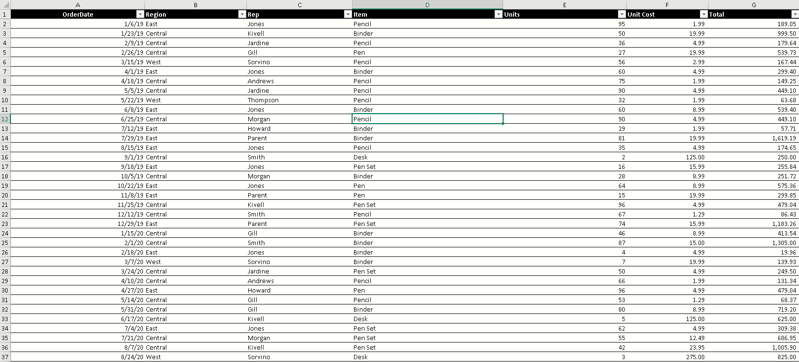
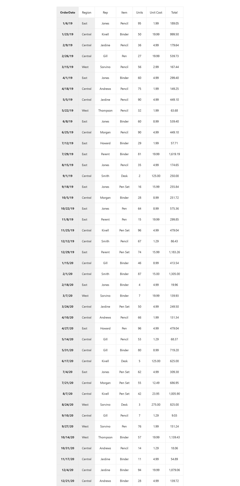

# <center>EXCEL2HTML</center>


### This repository contains code made to read a microsoft excel file contained within it's outer folder structure and convert it into a html table.
---
---
### USAGE:

> simply place the excel workbook you wish to convert into an html table 


---


---
> As you can see from the difference between the screenshot of the source spreadsheet and it's html rendering .... this project is still a work in progress.
---

---
---


```
\___________________________________________________
bryan_dir:excel-2-html-table_exitstatus:0 ====>

tree -d -L 2
.
├── assets
├── doccumentation
└── src
    └── node_modules

4 directories

\___________________________________________________
bryan_dir:excel-2-html-table_exitstatus:0 ====>

tree -L 2
.
├── README.md
├── SampleData.html
├── SampleData.xlsx
├── assets
│   ├── 2021-01-27-14-27-34.png
│   └── 2021-01-27-14-31-00.png
├── doccumentation
│   ├── cheerio.md
│   ├── notes.md
│   └── xlsx.md
├── src
│   ├── index.js
│   ├── node_modules
│   ├── package-lock.json
│   └── package.json
└── ~$SampleData.xlsx

4 directories, 12 files


```


### Commented Source Code:

```js

"use strict";
let fs = require('fs');
let process = require('process');
let workingDirectory = process.cwd().slice(2);
let XLSX = require('xlsx');
let workbook = XLSX.readFile(process.argv[2]);
let sheets = workbook.Sheets;
let htmlFile = '';
let rowNumber;
let htmlArray;

// Check to make sure user provides argument for command line
if (typeof process.argv[2] === 'undefined') {
  console.log('\n' + 'Error:' + '\n' + 'You must enter the excel file you wish to build tables from as an argument' + '\n' + 'i.e., node toTable.js resolutions.xlsx');
  return;
} else {
  // Check that the file is the correct type
  if (process.argv[2].slice(-4) !== 'xlsx') {
    console.log('\n' + 'This program will only convert xlsx files' + '\n' + 'Please enter correct file type');
    return;
  } else {
    // Create the HTML file name to write the table to
    var fileName = process.argv[2];
    var newFileName = fileName.slice(0, -4) + 'html';
  }
}

//htmlFile += '<html>' + '\n' + '<body>' +'\n';

function getPosition(string, subString, index) {
   return string.split(subString, index).join(subString).length;
}
// Iterate through each worksheet in the workbook
for (var sheet in sheets) {
  
  // Start building a new table if the worksheet has entries
  if (typeof sheet !== 'undefined') {
    htmlFile += '<table summary="" class="turntable">' + '\n' + '<thead>';    
    // Iterate over each cell value on the sheet
    for (var cell in sheets[sheet]) {      
              
      // Protect against undefined values
      if (typeof sheets[sheet][cell].w !== 'undefined') {
        //The first row in the table
        if (cell === 'A1') {
          htmlFile += '\n' + '<tr>' + '\n' + '<th>' + sheets[sheet][cell].w.replace('& ', '&amp;').replace('-', '&ndash;').replace('–', '&mdash;') + '</th>';
        } else {
          //The second row in the table closes the thead element
          if (cell === 'A2') {
            htmlFile += '\n' + '</tr>' + '\n' + '</thead>' + '\n' + '<tr>' + '\n' + '<th>' + sheets[sheet][cell].w.replace('& ', '&amp;').replace('-', '&ndash;').replace('–', '&mdash;') + '</th>';
          } else {
            // The first cell in each row
            if (cell.slice(0, 1) === 'A') {
              htmlFile += '\n' + '</tr>' + '\n' + '<tr>' + '\n' + '<th>' + sheets[sheet][cell].w.replace('& ', '&amp;').replace('-', '&ndash;').replace('–', '&mdash;') + '</th>';
              //All the other cells
            } else {
              htmlFile += '\n' + '<td>' + sheets[sheet][cell].w.replace('& ', '&amp;').replace('-', '&ndash;').replace('–', '&mdash') + '</td>';
            }
          }
        }
      }
    }
    // Close the table
    htmlFile += '\n' + '</tr>' + '\n' + '</table>' + '\n';
  }
  /*console.log(sheets[sheet]['!merges']);
  sheets[sheet]['!merges'].forEach(function(merge, index) {
    //console.log(merge);
    rowNumber = (getPosition(htmlFile, '<th>', (merge.s.r+1)) + 3);
    console.log(rowNumber);
    htmlArray = htmlFile.split('');
    htmlArray.splice(rowNumber, 0, ' colspan="3"');
    htmlFile = htmlArray.join('');
  });*/
}
// Close the file
//htmlFile += '</body>' + '\n' + '</html>';

// Write htmlFile variable to the disk with newFileName as the name
fs.writeFile(newFileName, htmlFile, (err) => {
  if (err) throw err;
  console.log('\n' +'Your tables have been created in', newFileName);
});

```

